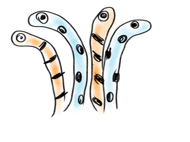

# image2ascii
`image2ascii` is a command line application to convert image file to ascii art.

```console
$ cargo run --release --bin image2ascii -- --input <image file> --width <width of ascii art>
$ cargo run --release --bin image2ascii -- --input ./img/spotted_garden_eel.png --width 100
                                                      ,l!i`                                        
                   _ir=l`I-                         -/+zt-i{r                                       
               _^sao/sF{f|t](1|:                   JXA9Bh] 18                                       
              Io; |3so@TLJ   'i[jc:              |v6eSVRSn ]2          . '`_                        
              <{   'vEnIe)       !j*i           ;S_ (]~^]  9^    :=[[L2hxr[t1us_                    
               /z=il"(sur     'un| `cxI         21        h*  iaa1i tW@Cbl    1B                    
        :__`     _:llI!I;)[^1|TyPdR  Ix>        S  __   _9c lfc:     rjz;   _ljj                    
      t+tn>j*t))l_          ,=)Epd{'   aE.     1Dti_    7z sh,   `     -Ir[z)1,                     
     |8 F3rv>+ !r]^)(=-         lf[     r{I    k2MMHJ~ nL jh  j8b82 ^n)t|!-                         
     ;9 n/|asu    _`I~nLc|        >o'    _oi   8 ;hw@DJ} 1Z  -$yTTC+1                               
      r\|r[t=:~lIlI. ^U@<;\)       ihr .cjuS`  9.   uE9n 3:   ,alfv                                 
        ::Il~~l|~r)c/Yy>   uk'      _6i #ZUqT_ 6(     9 fh[     IS                                  
                    =Tt ._. ;9.      rS cR4&fk +Eva  tkfOwL    'T!                                  
                     `T,  `nhU{       T[ ,zr Bi1LT@mE?EV@@>    os                                   
                      s0'<y@4`ef      Fj     +z_91{YpZF{c^    lB                                    
                       YXj/i   6!     E< .   vs S  "-v9u      ?E                                    
                       'Z!  !i *e     h<     Ez P`_. uD'      0(                                    
                        :Pr :I_|2t.   o*,cI  os 5';" |9     c~R                                     
                         _SiJDM$qv    a9$gy, Ss SsXZcJe    f@Ay                                     
                          /H0Sx_sE    nbM@O" 71l2+@AM@2    4@QC                                     
                          I3  _ lB    vJ:2n  2 \v FofqN    tzK)                                     
                           o[ _  8-   7t    cS B= '! ,R      2_                                     
                           sF    Sc_ !9     9= 6_ --. 7" -~ _3                                      
                            8`'xU@5l Jx  `1zT  P      E1x#e/|2                                      
                            \X7dj>u  0; .d]P}  6J2Ea, *JC@<k1B                                      
                            sS   .. nE  .VZHs  rbRbwM*jf17e_l6                                      
                            jo     /v    'rI    )v~12xjJ    _B                                      
                            Tn   :Jn             t<   <r     =                                      
                           =R    `_               ..                                                
                           1-                                                                       
```



# string2ascii
`string2ascii` is a command line application to convert string to ascii art.

```console
$ cargo run --release --bin string2ascii -- --input <string> --height <height of ascii art> --ch <character of ascii art>
$ cargo run --release --bin string2ascii -- --input 'Hello!' --height 15 --ch '@'
                                                          
                               @    @@                     
  @@        @@                 @    @@                 @@  
  @@        @@                 @    @@                 @@  
  @@        @@     @@@@@@@     @    @@     @@@@@@@     @@  
  @@@@@@@@@@@@    @@     @@    @    @@   @@      @@    @@  
  @@        @@    @@@@@@@@@    @    @@   @@       @@   @@  
  @@        @@    @@           @    @@   @@       @@       
  @@        @@    @@           @    @@    @@     @@        
  @@        @@      @@@@@@@    @    @@      @@@@@      @@  

```


